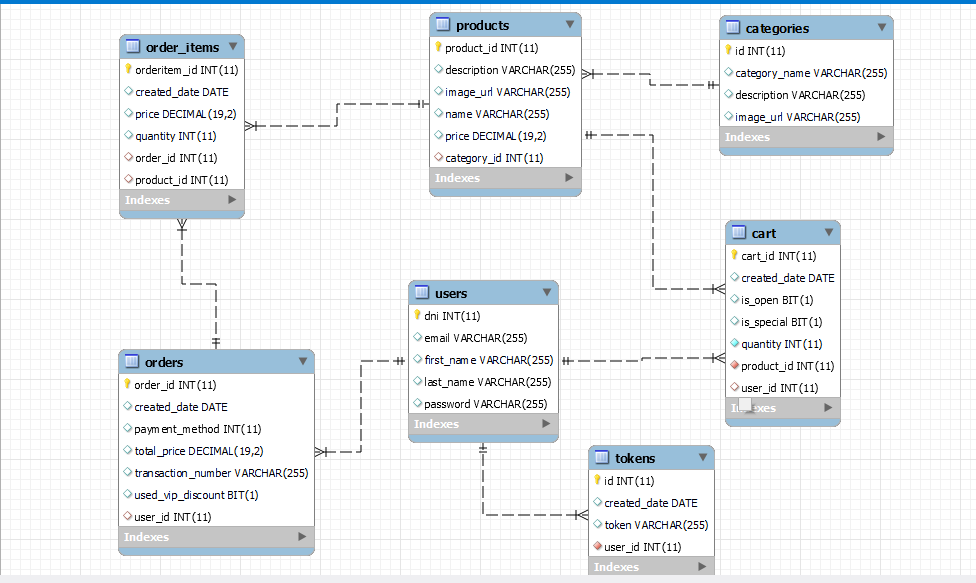

# Ecommerce app Factor It 
 Este es un repo con la resolución del 
 challenge que me propuso Factor It. Muchas gracias a la persona que lo va a corregir por su tiempo!!
 

###Modelo de datos de la app:

### Como levantar la app:
 
#### con maven:
Una vez clonado el repo ejecutar "mvn spring-boot:run" (corre con base de datos en memoria)

### con el ide:
Buscar la clase EcommerceApplication y darle run (corre con base de datos en memoria)

### con docker:
Ejecutar docker-compose up en la raiz del proyecto (donde se encuentra el docker file) esta imagen de docker 
levanta una base de datos mysql y adminer (no es lindo pero sirve para ver las tablas desde el explorador)

### Accesos

base de datos h2:
  user: sa
  pass: password

base de datos mysql:
  user: user
  pass: password

token para usar los recursos de la api: abc 

nota sobre el token:
hay que pasarlo en como un request param, si! no es nada seguro en una aplicacion real usaria el header.

#Consideraciones importantes:

La api puede estar mucho mejor, la base de datos podría tener más constraints, hice los test solamente probando 
parte del dinero que siempre es la más importante (pero con tiempo puedo hacer integration tests, test en la
capa de datos, los servicios). Elegi fechas sin hora porque es una app de prueba, en un pedido la hora es muy 
importante pero no lo considere para esta solucion. User en esta app es el usuario administrador y tambien 
el cliente porque no use diferentes tipos de autorizacion. Hay algunos datos harcodeados como el valor de los
descuentos, en una app real los sacaria de las tablas.